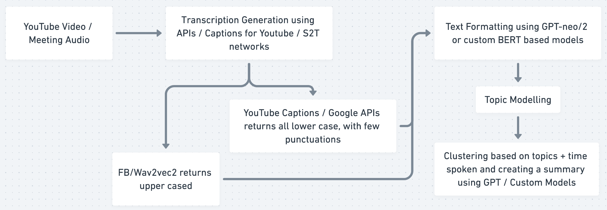

# MeetReducer

This takes the audio from meetings and automatically builds notes from it.

For this demo we are using the popular "All-In" podcast, but you can record your own clip using `record.py` file.

<a href="https://www.youtube.com/watch?v=rWEPSKkkdKQ">
  
</a>

## What?

The pipeline looks as follows:



Now initially tried to implement the Custom BERT based algorithms and we have provided an example of the same with AutoCasing [here](./AutoCase-BERT.ipynb). But we soon realised that GPT gives far better results, moreover GPT can be put on a server and be used as a centralised source.

Using GPTs is unlike anything out there, it a good idea to understand what is [prompt-designing](https://beta.openai.com/docs/introduction/). Since all GPTs behave the same way, you can expect the same results using `gpt2-xl` or `gpt-neo-2.7B` that you see with OpenAI GPT-3. GPTs obey scaling laws, so any task that a smaller GPT (say 125Mn params) can do will be solvable by larger (say 1.5Bn params) model but not the other way around. 

### Requirements

At the top of `MeetReduce` notebook you'll see the packages need to be installed. For running on NBX platform, please install following packages in this order:

```bash
sudo apt update -y                  # always update OS
sudo apt install libsndfile1 -y     # system package for soundfile
sudo apt install ffmpeg -y          # ffmpeg is <3
pip install youtube_dl pytube      # youtube things
pip install transformers datasets  # models
pip install soundfile pydub        # audio files
```

### Files

- `captions/`: folder with SRT file for above mentioned podcast, can be downloaded from the notebook, given here for reference.
- `record.py`: file to record your own audio. Also pass number of seconds if you want as `record.py 23`, will record for 23 seconds.
- `collate_methods.py`: file with different collation methods for training `AutoCase-BERT`
- `AutoCase-BERT`: sample notebook for how to train a BERT for AutoCasing